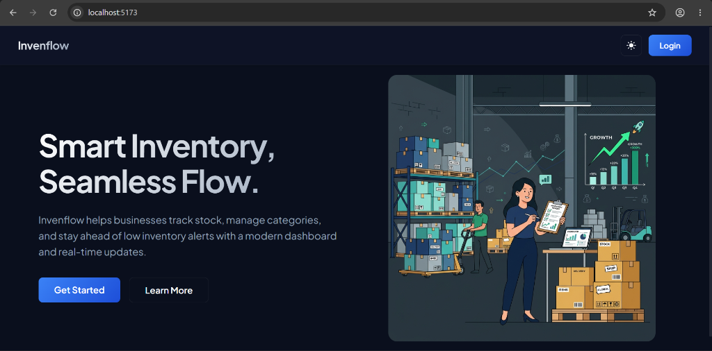
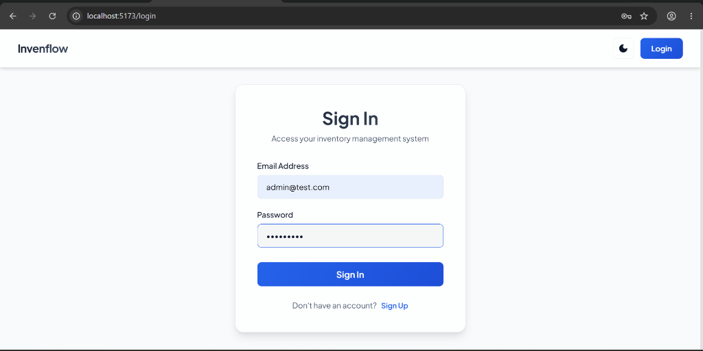
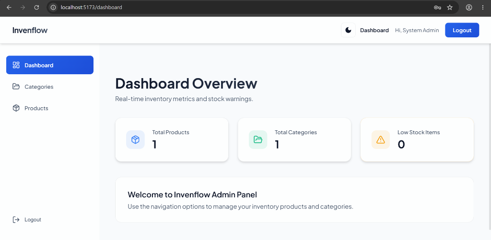
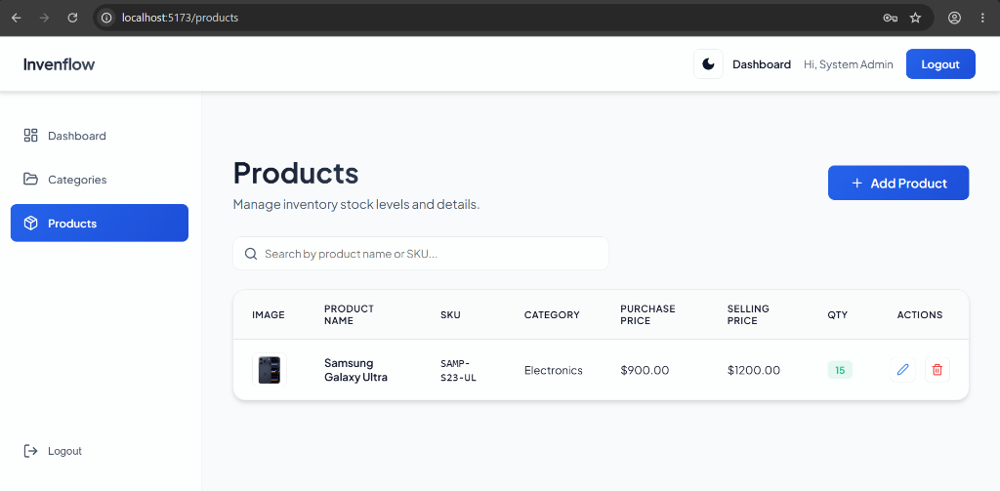
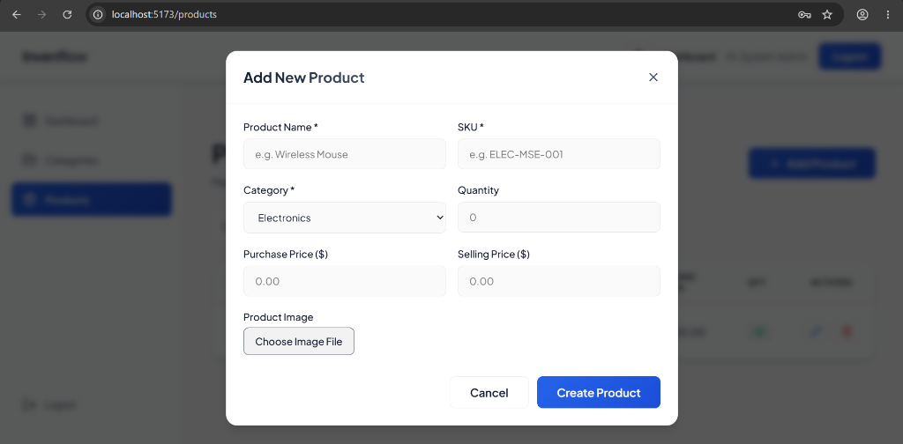

# Invenflow - Inventory Management System

A premium, modern, and responsive Inventory Management System built on the MERN stack. Features user authentication, a live dashboard, category management, paginated product directories with Cloudinary image uploads, and interactive dark/light mode switching.

---

## 🚀 Key Features

* **User Authentication**: Secure JWT-based auth with password encryption using `bcrypt` and session persistence.
* **Dashboard Overview**: Displays key inventory statistics: Total Products, Total Categories, and Low Stock Warnings (Quantity < 10).
* **Category Management**: Add, edit, delete, and list product categories via popup modal forms.
* **Product Catalog**: Add, edit, delete, and list products with SKU validation, image upload, and search filters.
* **Pagination**: Frontend and backend integrated pagination (6 items per page) for product listings.
* **Product Image Upload**: Real-time local image file previews uploaded to the backend and stored securely in Cloudinary.
* **Dark / Light Mode**: Dynamic CSS-variable theme toggle with a smooth transition.
* **Clean UI/UX**: Mobile responsive side navigation with fluid scrollbar layouts and success/error toasts (`react-hot-toast`).

---

## 🛠️ Tech Stack

* **Frontend**: React.js (Vite), React Router v7, Axios, Lucide Icons, Vanilla CSS (Premium Glassmorphic/Slate theme)
* **Backend**: Node.js, Express.js, MongoDB (Mongoose ODM)
* **Storage & Utilities**: Multer, Cloudinary (image storage), JWT (auth tokens), Bcrypt.js (password encryption)

---

## 📁 Repository Structure

```text
Inventory-Management-System/
├── backend/                  # Express.js REST API
│   ├── config/               # Database and Cloudinary configs
│   ├── controllers/          # API route handlers
│   ├── middlewares/          # Auth verification middleware
│   ├── models/               # MongoDB Mongoose schemas
│   ├── routes/               # Express endpoints
│   ├── services/             # Database queries and operations
│   ├── utils/                # Token generation & async handlers
│   ├── .env.example          # Backend environment variables template
│   ├── seed.js               # Database seeding script for admin user
│   └── server.js             # Main server entrypoint
│
└── frontend/                 # React.js SPA (Vite)
    ├── public/               # Public assets (images, icons)
    ├── src/
    │   ├── api/              # Configured Axios api client
    │   ├── components/       # Reusable layout and module views
    │   ├── context/          # Auth state react context
    │   ├── index.css         # Global stylesheets & design system variables
    │   ├── App.jsx           # App layout and routes configuration
    │   └── main.jsx          # Entrypoint rendering app
    └── .env.example          # Frontend environment variables template
```

---

## ⚙️ Installation & Setup

### Prerequisites
* [Node.js](https://nodejs.org/) (v16+ recommended)
* [MongoDB](https://www.mongodb.com/) (running locally or via MongoDB Atlas)

---

### Step 1: Clone and Configure Backend

1. Navigate to the backend directory:
   ```bash
   cd backend
   ```
2. Install dependencies:
   ```bash
   npm install
   ```
3. Create a `.env` file in the `backend/` root directory by copying the example template:
   ```bash
   copy .env.example .env
   ```
4. Open the new `.env` file and configure your credentials (e.g. MongoDB URL, Cloudinary configuration keys, and a random JWT Secret):
   ```env
   PORT=5000
   MONGO_URI=mongodb://localhost:27017/inventory_mgmt
   JWT_SECRET=your_super_secret_jwt_key
   CLOUDINARY_CLOUD_NAME=your_cloudinary_cloud_name
   CLOUDINARY_API_KEY=your_cloudinary_api_key
   CLOUDINARY_API_SECRET=your_cloudinary_api_secret
   ```

---

### Step 2: Seed the Database (Default Admin User)

Before running the server, seed the database to register the default administrator:
1. From the `backend/` directory, run the seed script:
   ```bash
   node seed.js
   ```
2. Once complete, you will see a success message. You can log in using these default credentials:
   * **Email**: `admin@test.com`
   * **Password**: `Admin@123`

---

### Step 3: Configure Frontend

1. Navigate to the frontend directory:
   ```bash
   cd ../frontend
   ```
2. Install dependencies:
   ```bash
   npm install
   ```
3. Create a `.env` file in the `frontend/` root directory by copying the example template:
   ```bash
   copy .env.example .env
   ```
4. Verify that `VITE_API_URL` points to your backend proxy mount (usually `/api` during local development, which is proxied in Vite config to `http://localhost:5000`):
   ```env
   VITE_API_URL=/api
   ```

---

## 🏃 Running the Application

### 1. Start the Backend Server
From the `backend/` directory, start the development server (runs nodemon):
```bash
npm run dev
```
The API server will launch on port **5000** (`http://localhost:5000`).

### 2. Start the Frontend Server
From the `frontend/` directory, start the Vite development server:
```bash
npm run dev
```
Open your browser and navigate to **`http://localhost:5173/`** to interact with the UI.

---

## 🔌 API Endpoints Summary

### User Authentication
* `POST /api/auth/signup` - Register a new user
* `POST /api/auth/login` - Authenticate user & return token
* `POST /api/auth/logout` - Clear user session

### Dashboard Overview
* `GET /api/dashboard` - Retrieve total product, category, and low stock counts

### Category Management
* `GET /api/categories` - Fetch all categories
* `POST /api/categories` - Create a new category
* `PUT /api/categories/:id` - Update category details
* `DELETE /api/categories/:id` - Delete a category

### Product Catalog
* `GET /api/products` - List products (supports query parameters: `search`, `page`, `limit`)
* `POST /api/products` - Add a new product (supports image upload payload)
* `PUT /api/products/:id` - Update product details (supports image upload payload)
* `DELETE /api/products/:id` - Remove a product from inventory

---

## 📸 Screenshots

Here are some screenshots demonstrating the responsive user interface of Invenflow:

### Homepage / Hero Section


### Sign In


### Dashboard Overview


### Products Directory


### Add Product Modal


